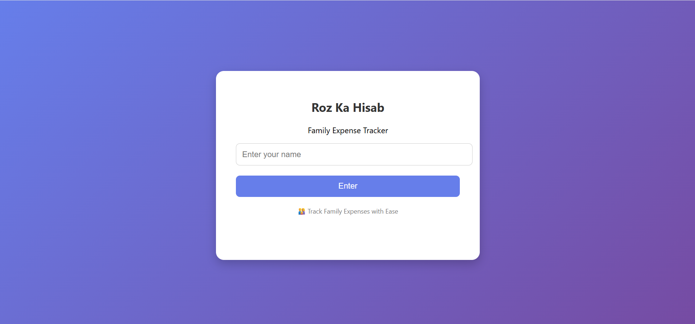
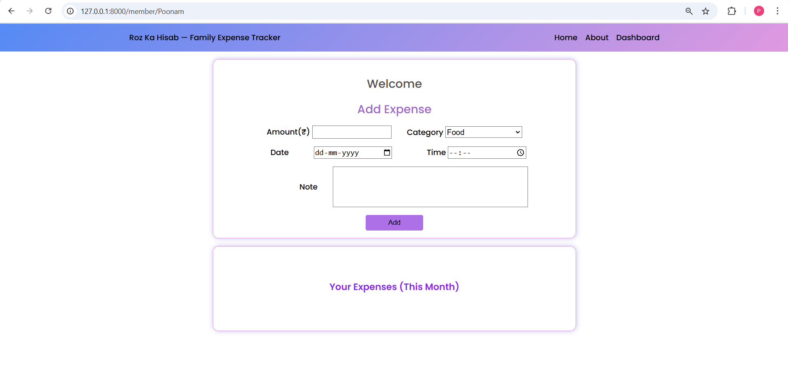
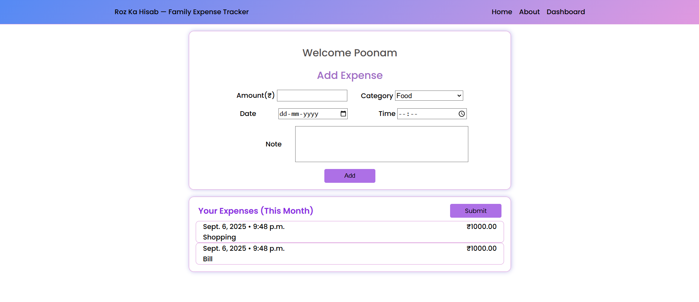
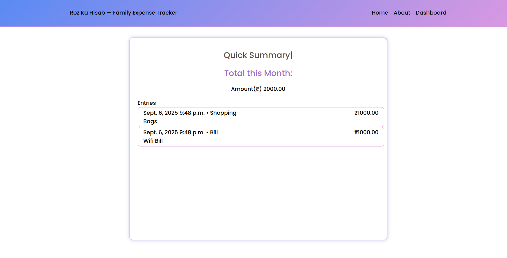
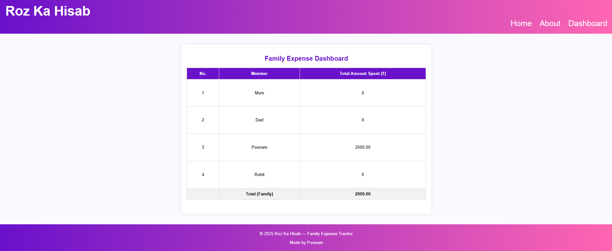
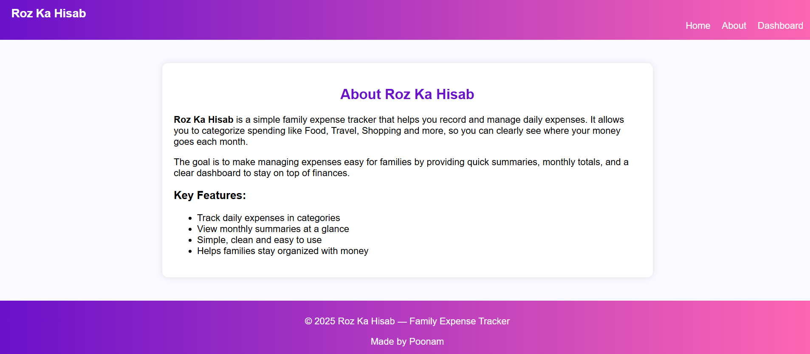

# Roz-ka-Hisab
Roz Ka Hisab is a Django-based web application designed to track, manage, and analyze daily family expenses.
It helps family members record their expenses, view individual totals, and see the overall family spending in one dashboard.

🚀 Features

👥 Manage family members

💰 Add and track expenses per member

📊 Dashboard showing total expenses per member

🧾 View overall family total

📈 (Future) Graphs & charts for expense analysis

🛠️ Tech Stack

Backend: Django (Python)

Frontend: HTML, CSS, JavaScript (Django Templates)

Database: SQLite (default)

📸 Screenshots
## 📸 Screenshots  

### 🏠 Home  
  

---

### 👥 Member  

  

---

### 💰 Account  
  

---

### 📊 Dashboard  
  

---

### ℹ️ About  
  

